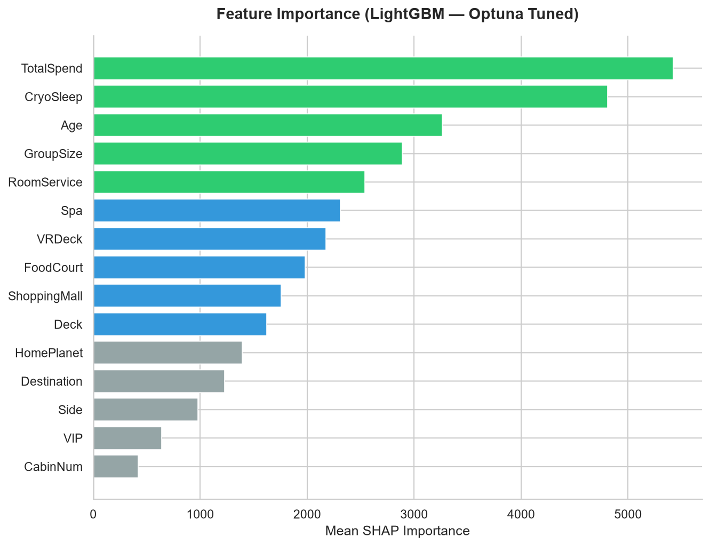

<div align="center">

# Spaceship Titanic

Predicting passenger transportation using gradient boosting models, group-aware validation, feature ablation, and model ensembling.

[](https://python.org)
[](https://lightgbm.readthedocs.io)
[](https://catboost.ai)
[](https://optuna.org)
[](https://shap.readthedocs.io)
[](LICENSE)

</div>

---

## Overview

This repository contains my solution for Kaggle's **Spaceship Titanic** competition.

The objective is to predict whether a passenger was transported to another dimension after the Spaceship Titanic collided with a spacetime anomaly.

Rather than relying on heavy feature engineering, this project focuses on building a reliable tabular machine learning workflow using:

- Leakage-aware validation
- Fold-safe preprocessing
- Feature ablation
- Hyperparameter optimization
- Probability threshold tuning
- Model ensembling
- SHAP explainability

The final solution combines **LightGBM** and **CatBoost** models trained using **GroupKFold cross-validation**.

---

## Competition

**Kaggle Competition:**  
https://www.kaggle.com/competitions/spaceship-titanic

### Problem Type

Binary Classification

Target:

```python
Transported = True / False
```

---

## Dataset

| Dataset | Rows |
|----------|----------|
| Train | 8,693 |
| Test | 4,277 |

### Available Features

#### Passenger Information

- HomePlanet
- Destination
- Age
- VIP
- CryoSleep

#### Cabin Information

- Cabin
- Deck
- Side

#### Spending Information

- RoomService
- FoodCourt
- ShoppingMall
- Spa
- VRDeck

---

## Validation Strategy

One important characteristic of this dataset is that passengers often travel in groups.

Multiple passengers can share the same group identifier inside `PassengerId`.

Using standard KFold can leak information between training and validation folds because members of the same group may appear in both sets.

To prevent this:

```python
GroupKFold(n_splits=5)
```

was used throughout the project.

The passenger group extracted from `PassengerId` is treated as the grouping variable.

This ensures that all members of a travel group remain inside the same fold.

---

## Data Preparation

The preprocessing pipeline was designed to avoid information leakage.

### Missing Value Handling

Categorical variables:

- HomePlanet
- Destination
- CryoSleep
- VIP
- Deck
- Side

are imputed using statistics learned from the training fold only.

Numerical variables:

- Age
- RoomService
- FoodCourt
- ShoppingMall
- Spa
- VRDeck

are filled using fold-specific medians.

### Cabin Parsing

The Cabin feature is split into:

- Deck
- Cabin Number
- Side

These features provide more useful information than the original Cabin string.

---

## Feature Engineering

Several engineered features were tested through ablation studies.

### Retained Features

#### TotalSpend

```python
TotalSpend =
RoomService +
FoodCourt +
ShoppingMall +
Spa +
VRDeck
```

Provides a strong signal regarding passenger behaviour.

#### GroupSize

Number of passengers travelling within the same group.

Calculated using training-fold information only.

---

### Removed Features

The following features were tested but ultimately removed:

- Age bins
- IsChild
- Spend ratios
- Log-transformed spending variables
- Manual interaction features
- Family-based statistics
- Hand-crafted spending categories

These additions either produced no measurable improvement or increased complexity without improving validation performance.

---

## Hyperparameter Optimization

LightGBM hyperparameters were tuned using Optuna.

### Search Process

- 5-Fold GroupKFold CV
- MedianPruner
- Accuracy-based optimization
- Early stopping of weak trials

Parameters searched included:

- Learning Rate
- Number of Leaves
- Maximum Depth
- Regularization
- Subsampling
- Column Sampling

---

## Models

### LightGBM

Used as the primary gradient boosting model.

Advantages:

- Fast training
- Native categorical support
- Strong performance on tabular data

### CatBoost

Used as the second ensemble component.

Advantages:

- Excellent handling of categorical variables
- Robust performance with minimal preprocessing

---

## Ensemble

A soft-voting ensemble was evaluated using out-of-fold predictions.

```python
Ensemble =
(LightGBM + CatBoost) / 2
```

XGBoost was also tested during experimentation but was removed after ablation testing showed no consistent improvement over the two-model ensemble.

---

## Threshold Optimization

Instead of always using:

```python
0.50
```

as the classification threshold, thresholds were evaluated over a range of probabilities using out-of-fold predictions.

This allowed the final decision boundary to be selected using validation data rather than assumptions.

---

## Model Explainability

SHAP was used to interpret model predictions.

### Main Findings

- TotalSpend is one of the strongest predictors.
- CryoSleep has a major impact on transportation probability.
- Spending behaviour strongly influences predictions.
- Age contributes non-linear effects.

### SHAP Summary


---

## Visualizations

### Feature Importance



### Model Comparison


### SHAP Summary


### Kaggle Leaderboard


---

## Results

| Model | Cross Validation Accuracy |
|---------|---------|
| LightGBM | Generated during execution |
| CatBoost | Generated during execution |
| LightGBM + CatBoost Ensemble | Generated during execution |

All scores are calculated using out-of-fold predictions from GroupKFold validation.

---

## Project Structure

```text
spaceship-titanic-ml-pipeline/
│
├── notebook/
│   └── spaceship-titanic-ml-pipeline.ipynb
│
├── screenshots/
│   ├── feature_importance.png
│   ├── shap_summary.png
│   ├── model_comparison.png
│   └── leaderboard.png
│
├── outputs/
│   └── submission.csv
│
├── requirements.txt
├── README.md
├── LICENSE
└── .gitignore
```

---

## Installation

Clone the repository:

```bash
git clone https://github.com/SyedMuhammadMujtabaKhalid/spaceship-titanic-ml-pipeline.git
cd spaceship-titanic-ml-pipeline
```

Create a virtual environment:

```bash
python -m venv venv
```

Install dependencies:

```bash
pip install -r requirements.txt
```

---

## Running the Project

Open the notebook:

```bash
jupyter notebook notebook/spaceship-titanic-ml-pipeline.ipynb
```

Run all cells to:

- Load data
- Perform preprocessing
- Train models
- Optimize hyperparameters
- Generate SHAP analysis
- Create final Kaggle submission

---

## Lessons Learned

- Simpler feature sets often outperform heavily engineered alternatives.
- Group-aware validation is critical when observations belong to the same entity.
- Native categorical handling can reduce preprocessing complexity.
- Small improvements from threshold tuning can still be meaningful in Kaggle competitions.
- Ablation studies are useful for identifying unnecessary features.

---

## Author

### Syed Muhammad Mujtaba Khalid

Machine Learning • Data Science • Computer Vision

GitHub:
https://github.com/SyedMuhammadMujtabaKhalid

---

⭐ If you found this project useful, consider starring the repository.
