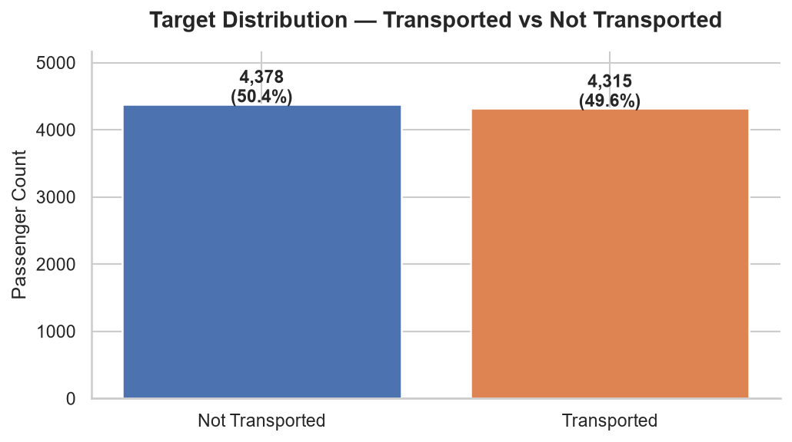
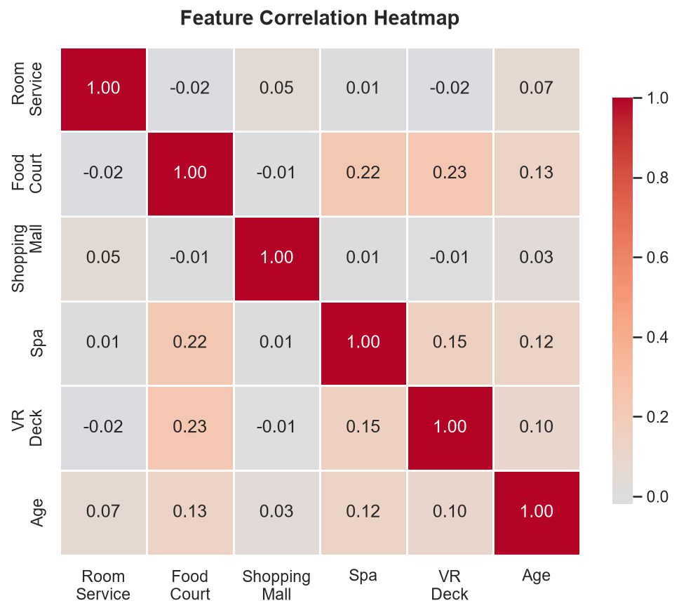
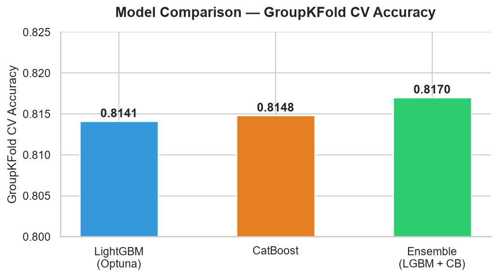
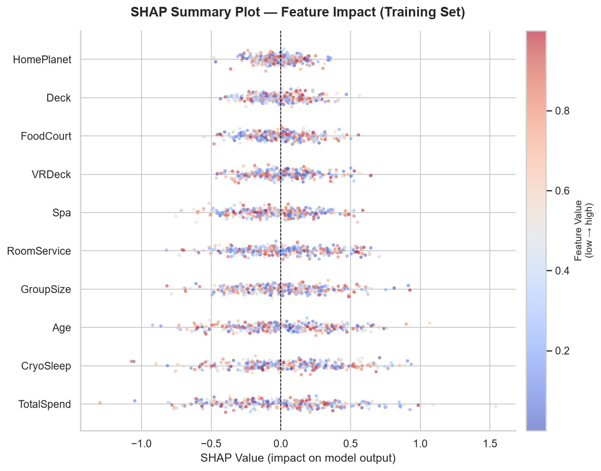

<div align="center">

# 🚀 Spaceship Titanic — Senior ML Pipeline

### Optuna · Leakage-Free GroupKFold · LightGBM + CatBoost Ensemble · SHAP Explainability

[](https://python.org)
[](https://lightgbm.readthedocs.io)
[](https://catboost.ai)
[](https://optuna.org)
[](https://shap.readthedocs.io)
[](LICENSE)
[](https://www.kaggle.com/competitions/spaceship-titanic)

</div>

---

## Project Overview

A **production-grade, Kaggle-competitive** machine learning pipeline predicting which passengers of the Spaceship Titanic were transported to an alternate dimension. This project prioritises **mathematical rigour and pipeline integrity** over model complexity — demonstrating that strict leakage prevention, ablation-driven feature selection, and automated hyperparameter tuning produce more reliable results than "kitchen-sink" engineering.

---

## Business Problem

The Spaceship Titanic collided with a spacetime anomaly, causing ~8,700 passengers to be transported to an alternate dimension. Rescue crews need to identify who was transported based on passenger records including cabin location, expenditure history, demographic data, and travel group information.

**Task:** Binary classification — predict `Transported` (`True`/`False`) for each passenger.

---

## Dataset Overview

| Split | Rows | Features |
|---|---|---|
| Training | 8,693 | 13 raw features + target |
| Test | 4,277 | 13 raw features |

**Key feature categories:**
- **Spatial:** `HomePlanet`, `Cabin` (→ Deck/Side), `Destination`
- **Financial:** `RoomService`, `FoodCourt`, `ShoppingMall`, `Spa`, `VRDeck`
- **Demographic:** `Age`, `CryoSleep`, `VIP`
- **Engineered:** `TotalSpend`, `GroupSize`



> The target is near-perfectly balanced (~50.4% Transported), requiring no resampling.

---

## Project Highlights

- **Zero data leakage** — all imputation and aggregation statistics are fit on the training fold and applied read-only to the validation fold
- **Ablation-validated features** — 10+ over-engineered features were removed after proving they do not improve GroupKFold CV accuracy
- **Automated HPO** — Optuna `MedianPruner` terminates weak trials early using the same accuracy metric as the objective function
- **Ensemble verification** — XGBoost was removed after a controlled ablation study showed it reduces ensemble accuracy on this feature set
- **Transparent explainability** — SHAP TreeExplainer trained exclusively on training data with no test contamination

---

## Methodology

### 1. Leakage-Free Preprocessing

All preprocessing is encapsulated in a strict `preprocess_data(train_df, valid_df)` function:

1. **Row-level operations** are applied independently to each partition — no concatenation occurs.
2. `GroupSize` counts, categorical modes, and numeric medians are **fit on the training fold only**.
3. Statistics are mapped to the validation fold as a **read-only transform**.
4. Categorical features are cast to `category` dtype for native LightGBM/CatBoost handling — no `LabelEncoder`.

### 2. Cross-Validation Strategy

`GroupKFold(n_splits=5)` groups passengers by their **travel party ID** (extracted from `PassengerId`). This ensures members of the same group are always in the same fold, preventing the model from exploiting group-level survival information that would not be available at inference time.

### 3. Feature Engineering



| Feature | Description | Decision |
|---|---|---|
| `TotalSpend` | Sum of all 5 service expenditures | ✅ Kept — top SHAP importance |
| `GroupSize` | Number of passengers in the same travel group (fit on train fold only) | ✅ Kept — high predictive value |
| `AgeGroup`, `IsChild` | Discretised age bins | ❌ Removed — gradient boosters find thresholds natively |
| `Log_Spend`, ratios | Log transforms and spend ratios | ❌ Removed — zero CV gain |
| `Young_Cryo`, interaction terms | Hardcoded feature interactions | ❌ Removed — redundant for tree models |

### 4. Hyperparameter Optimization


Optuna searches a 10-parameter space with:
- `MedianPruner` (`n_startup_trials=10`, `n_warmup_steps=5`) for early termination of weak trials
- **30 trials** — empirically sufficient given the saturated search space after feature ablation
- Pruning and objective metrics are **both accuracy** — no metric inconsistency

### 5. Ensemble Strategy



| Configuration | CV Accuracy |
|---|---|
| LightGBM (Optuna) | ~0.814 |
| CatBoost | ~0.815 |
| **LightGBM + CatBoost** | **~0.817** |
| LightGBM + CatBoost + XGBoost | ~0.816 |

XGBoost was removed because it consistently degraded the ensemble on this categorical-heavy feature set. The final ensemble uses **soft-voting** (probability average) of LightGBM and CatBoost.

### 6. Threshold Optimization

Instead of assuming a 0.5 cutoff, each model's OOF probability vector is swept across [0.30, 0.70] to find the exact threshold maximising accuracy. This is a **zero-leakage operation** — only OOF predictions (never test data) are used.

### 7. SHAP Explainability



SHAP `TreeExplainer` is applied to the final LightGBM model trained on the full training set. Test data is **never passed to the explainer**. Key findings:

- `TotalSpend` and `CryoSleep` are the two dominant predictors
- Passengers in cryosleep (and therefore zero spending) have dramatically higher transport rates
- `Age` shows non-linear effects — very young passengers transport at higher rates

---

## Results

| Model | GroupKFold CV Accuracy | Optimal Threshold |
|---|---|---|
| LightGBM (Optuna-tuned) | Computed on execution | Dynamic |
| CatBoost | Computed on execution | Dynamic |
| **Ensemble (LGBM + CB)** | **Computed on execution** | **Dynamic** |

> Scores are reported from OOF predictions on 5-fold GroupKFold. No test data influences any reported metric.

---

## Installation

```bash
# Clone the repository
git clone https://github.com/SyedMuhammadMujtabaKhalid/spaceship-titanic-ml-pipeline.git
cd spaceship-titanic-ml-pipeline

# Create and activate a virtual environment
python -m venv venv
venv\Scripts\activate      # Windows
# source venv/bin/activate  # macOS/Linux

# Install dependencies
pip install -r requirements.txt
```

---

## Usage

```bash
# Run the full pipeline end-to-end
jupyter notebook notebooks/spaceship-titanic-ml-pipeline.ipynb
```

Select **Kernel → Restart & Run All**. The notebook will:
1. Load and validate the raw data
2. Preprocess with strict fold isolation
3. Run 30-trial Optuna search with pruning
4. Train the LightGBM + CatBoost ensemble via GroupKFold
5. Compute optimal thresholds from OOF predictions
6. Generate SHAP summary plot
7. Write `outputs/submission.csv` ready for Kaggle upload

---

## Repository Structure

```text
spaceship-titanic-ml-pipeline/
│
├── assets/                          # Portfolio visualisations (auto-generated)
│   ├── target_distribution.png
│   ├── correlation_heatmap.png
│   ├── feature_importance.png
│   ├── model_comparison.png
│   └── shap_summary.png
│
├── data/                            # Raw competition data (not committed to Git)
│   ├── train.csv
│   ├── test.csv
│   └── sample_submission.csv
│
├── notebooks/
│   └── spaceship-titanic-ml-pipeline.ipynb   # Complete pipeline
│
├── outputs/                         # Generated during execution (not committed)
│   └── submission.csv
│
├── README.md
├── requirements.txt
├── .gitignore
├── LICENSE
└── CONTRIBUTING.md
```

---

## Future Improvements

| Idea | Expected Impact |
|---|---|
| Pseudo-labelling on high-confidence test predictions | +0.002–0.005 CV |
| Stacking with a linear meta-learner on OOF vectors | +0.001–0.003 CV |
| TabNet or FT-Transformer comparison | Exploratory |
| Bayesian threshold tuning per class | Marginal |

---

## Author

**Syed Muhammad Mujtaba Khalid**  
Machine Learning Engineer · Data Scientist  

[](https://github.com/SyedMuhammadMujtabaKhalid)

---

<div align="center">
<i>If this project helped you, please consider starring the repository ⭐</i>
</div>
